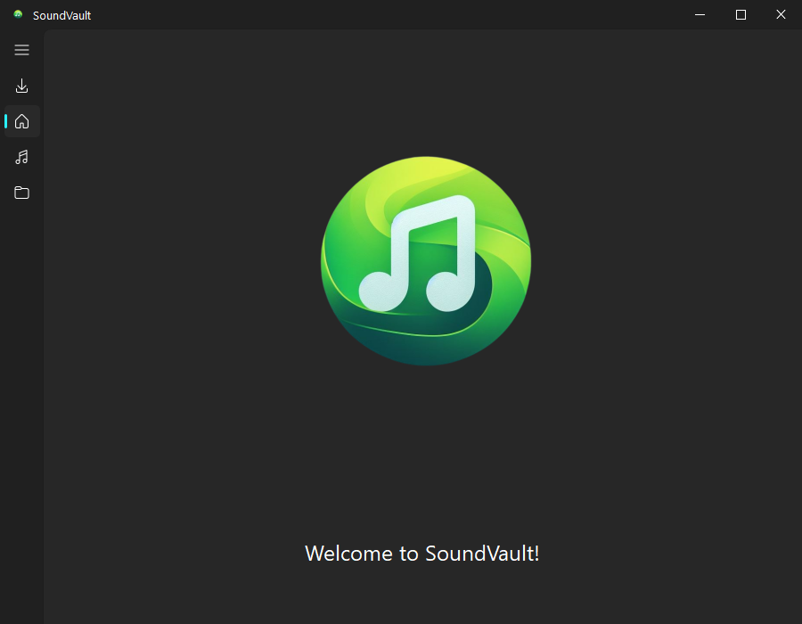
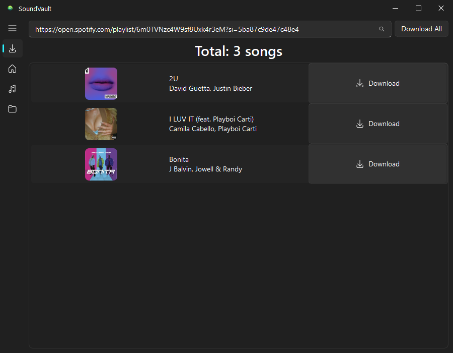
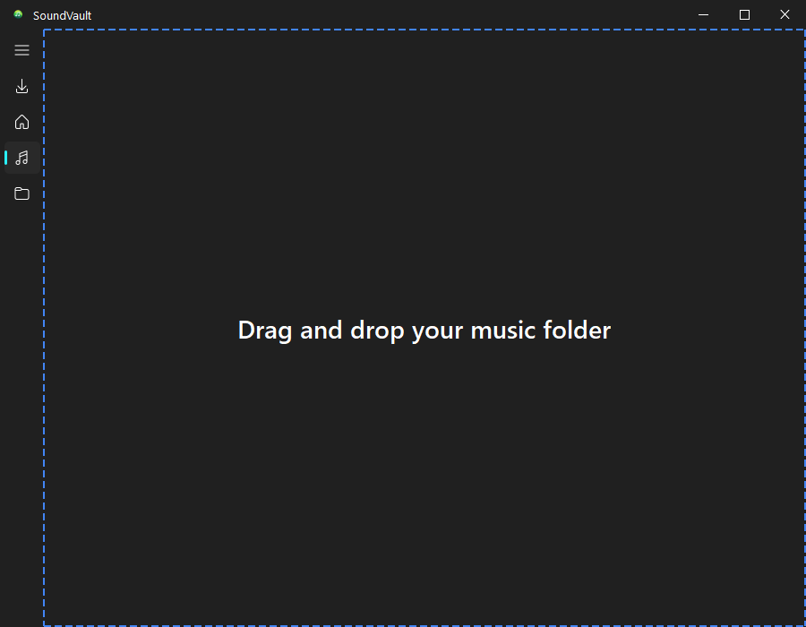
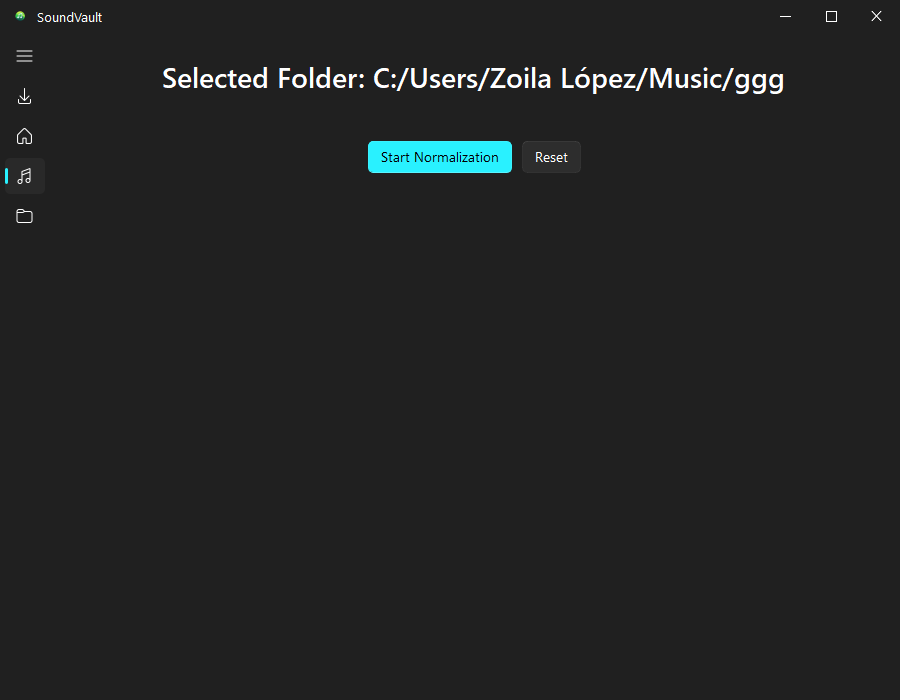
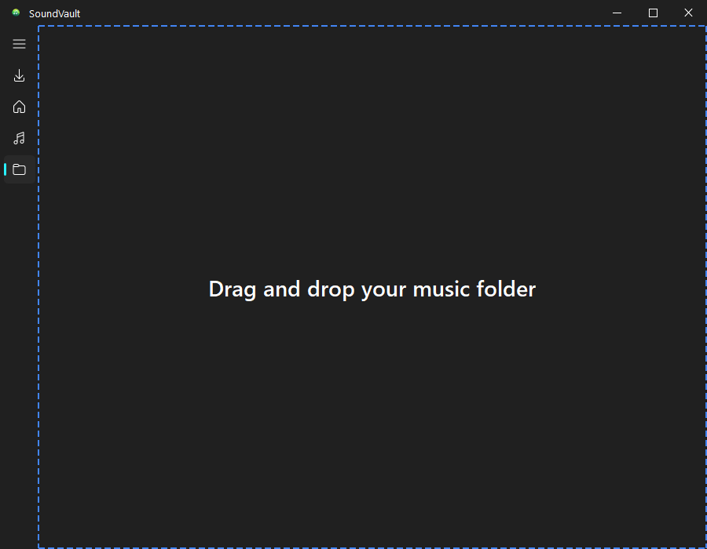
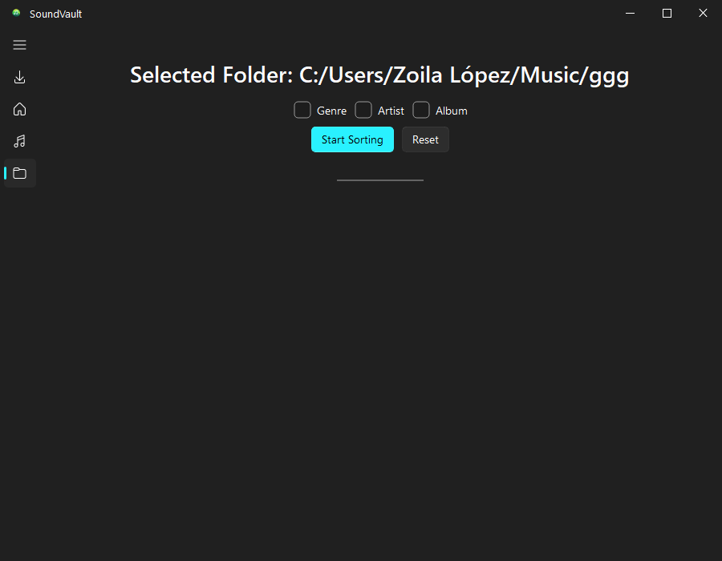

<div align="center">
  
  <h1>SoundVault</h1>
</div>

## About

This project is a PyQt5 application designed to enhance your music listening experience. It includes features for downloading songs, sorting them based on your preferences, and normalizing their audio levels for a consistent and enjoyable listening experience. The user interface is simple and intuitive.

## Installation

This project requires Python 3.11. If you don't have Python installed, you can download it from [python.org](https://www.python.org/downloads/).

Once you have Python installed, you can install the project as follows:

```bash
git clone https://github.com/elopez2021/soundvault.git
cd soundvault
pip install -r requirements.txt
```

## Usage

Once you have installed the project, you can run it as follows:

```bash
python main.py
```

## Demo

Here are some screenshots of the application in action:

Home Section:



Download Section:



Normalize Section:




Sort Section:




## Credits

This project was made possible just because of the following libraries:

- [spotDL](https://github.com/spotDL/spotify-downloader): A library to download Spotify songs.
- [FluentWidgets](https://github.com/PyQt5/FluentWidgets): A library to create fluent design widgets in PyQt5.
